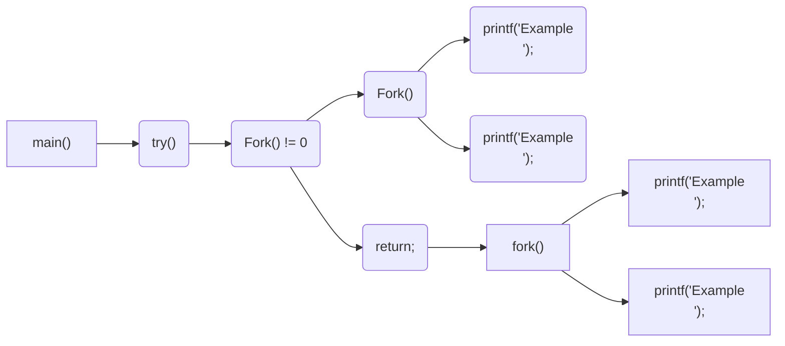
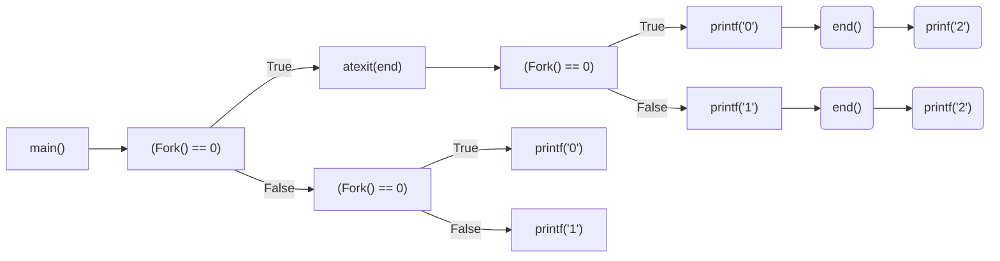
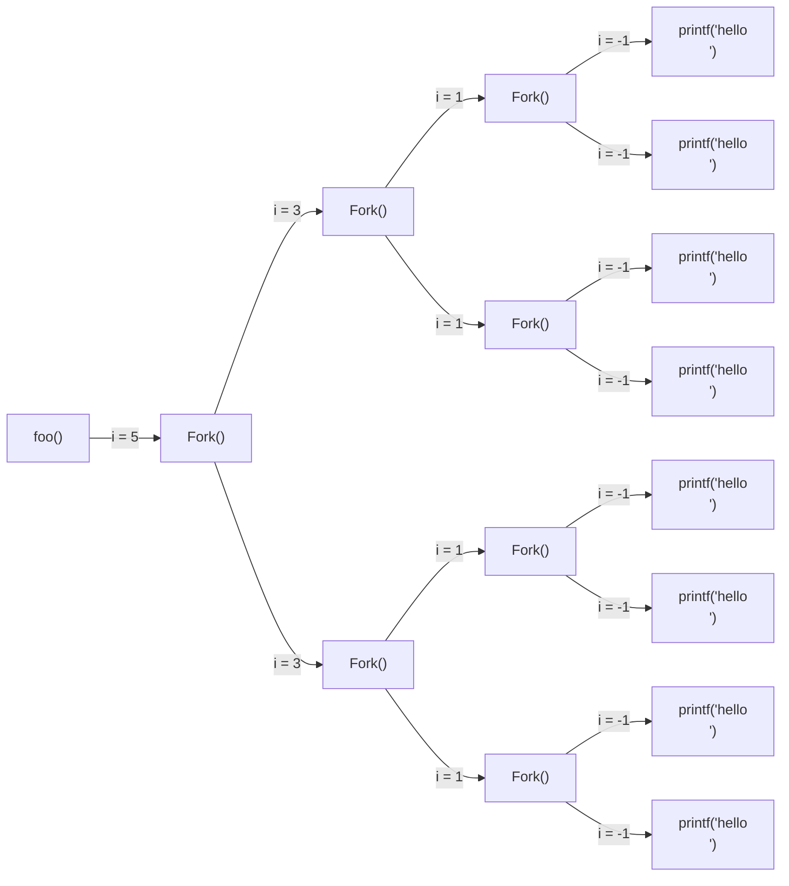
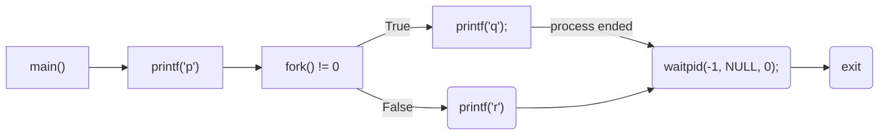

CSED211 Homework 5
===

20190084 권민재


# 1. Exercise 8.14

How many "Example" output lines does this program print?

```c
#include "csapp.h"

void try()
{
    if(Fork() != 0) {
        Fork();
        printf("Example\n");
        exit(0);
    }
    return;
}

int main();
{
    try();
    fork(); printf("Example\n");
    exit(0);
}
```

### Solution



> rectangle for main(), rounded-rectangle for try().

#### try()

 위 프로그램이 실행된 이후에는 우선 `try`가 불리게 되는데, 여기서 `(Fork() != 0)`에서 우선 포크가 일어나게 된다. 이후, `(Fork() != 0)`에 해당하는 프로세스에 대해, `Fork();`가 일어나고, 이후 `printf("Example\n");`에 의해 Example이 try에 의해서는 2번 출력된다.

#### main()

 main 함수에서는 우선 `try`가 종료된 이후에 `fork`를 진행하고, Example을 출력하게 된다. 즉, try()에서 출력되는 Example을 제외했을 때, main에서는 Example이 2번 출력된다.


 위 두 결과를 종합하여, 위 프로그램은 Example을 총 4번 출력한다.

### Answer

 This program print "Example" output lines **4 times**.


# 2. Exercise 8.18

Consider the following program:

```c
#include "csapp.h"

void end(void)
{
	printf("2"); fflush(stdout);
}

int main()
{
    if (Fork() == 0)
        atexit(end);
    if (Fork() == 0){
        printf("0"); fflush(stdout);
    }
    else {
        printf("1"); fflush(stdout);
    }
    exit(0);
}
```

 Determine which of the following outputs are possible. *Note:* The `atexit` function takes a pointer to a function and adds it to a list of functions (initially empty) that will be called when the exit function is called.

---



 위와 같이 프로세스의 다이어그램을 그려보았을 때, 한 프로세스에서 나올 수 있는 출력은 0, 1, 02, 12 중에 하나이다. 그렇기 때문에 0, 1, 02, 12를 하나씩 배열해서 나올 수 있는 문자열이 위 프로그램의 possible한 output이라고 생각할 수 있다.


## A.

**Solution.** 112002는 1, 12, 0, 02를 순서대로 배치한 결과이기 때문에, possible한 output이다.

**Answer.** Possible.


## B.

**Solution.** 2는 무조건 0 또는 1이 출력된 이후에만 출력될 수 있으므로, 2가 맨 처음으로 출력될 수는 없다.

**Answer.** Not possible.


## C.

**Solution.** 102120은 1, 02, 12, 0을 순서대로 배치한 결과이기 때문에, possible한 output이다.

**Answer.** Possible.


## D.

**Solution.** 122001에서 001은 0, 1, 02, 12을 배치해서 나올 수 없는 결과이기에, 불가능하다.

**Answer.** Not possible.


## E.

**Solution.** 100212는 1, 0, 02, 12를 순서대로 배치한 결과이기 때문에, possible한 output이다.

**Answer.** Possible.


# 3. Exercise 8.19

How many lines of output does the following function print if the value of n entered by the user is 6?

```c
void foo(int n)
{
    int i;
    for (i = n - 1; i >= 0; i-= 2)
    	  Fork();
   	printf("hello\n");
   	exit(0);
}
```

### Solution



 위 다이어그램에서 알 수 있다시피, hello는 총 8번 출력되게 된다.

### Answer

8 lines.


# 4. Exercise 8.21

What are the possible output sequences from the following program?

```c
int main()
{
	  printf("p"); fflush(stdout);
    if(fork() != 0) {
        printf("q"); fflush(stdout);
        return 0;
    }
    else {
        printf("r"); fflush(stdout);
        waitpid(-1, NULL, 0);
    }
    return 0;
}
```

### Solution



 위와 같은 다이어그램을 살펴보면, 우선 p가 출력된 이후에 두가지 경우가 가능하다. 첫번째로는 q가 출력된 이후 r이 출력되는 경우이고, 두번째 경우는 r이 출력된 이후 다른 프로세스를 대기하고 q가 출력된 후 대기 상태를 종료하고 프로그램이 종료되는 경우이다. 즉, pqr, prq 두가지 경우가 가능하다.

### Answer

pqr, prq


# 5. Exercise 9.12

Repeat Problem 9.11 for the following address.

Virtual address: 0x03a9

> Exercise 9.11
>
> In the follwing series of problems, you are to show how the example memory system in Section 9.6.4 translates a virtual address into a physical address and accesses the cache. For the given virtual address, indicate the TLB entry accessed, the physical address, and the cache byte value returned. Indicate whether the TLB misses, whether a page fault occurs, and whether a cache miss occurs. If there is a cache miss, enter "-" for "Cache byte returned". If there is a page fault, enter "-" for "PPN" and leave parts C and D blank.

> Example memory system in Section 9.6.4
>
> * The memory is byte addressable. 
> * Memory accesses are to 1-byte words (not 4-byte words).
> * Virtual addresses are 14 bits wide (n = 14).
> * Physical addresses are 12 bits wide (m = 12).
> * The page size is 64 bytes (P = 64).
> * The TLB is 4-way set associative with 16 total entries.
> * The L1 d-cache is physically addressed and direct mapped, with a 4-byte line size and 16 total sets.
>
> And TLB, page table, and cache for small memory system is at Book.

## A.

**Virtual address format**

|  13  |  12  |  11  |  10  |  9   |  8   |  7   |  6   |  5   |  4   |  3   |  2   |  1   |  0   |
| :--: | :--: | :--: | :--: | :--: | :--: | :--: | :--: | :--: | :--: | :--: | :--: | :--: | :--: |
|  0   |  0   |  0   |  0   |  1   |  1   |  1   |  0   |  1   |  0   |  1   |  0   |  0   |  1   |


## B.

**Address translation**

**VPN**

$n - \log_2 64 = 8$

0x03a9의 첫 8비트는 00001110이므로, VPN은 0xE

**TLB index**

$\log_2 \frac{16}{4} = 2$

TLB index는 VPN에서 가장 낮은 2비트, 즉 0x2 (0b10)

**TLB TAG**

TLB tag는 index를 제외한, 즉 0x3 (0b000011)

**PPN**

Page table에서 VPN 0xE는 PPN 0x11임을 확인.


|     Parameter     | Value |
| :---------------: | :---: |
|        VPN        |  0xE  |
|     TLB index     |  0x2  |
|      TLB tag      |  0x3  |
|  TLB hit? (Y/N)   |   N   |
| Page fault? (Y/N) |   N   |
|        PPN        | 0x11  |


## C.

**Physical address format**

| 11   | 10   | 9    | 8    | 7    | 6    | 5    | 4    | 3    | 2    | 1    | 0    |
| ---- | ---- | ---- | ---- | ---- | ---- | ---- | ---- | ---- | ---- | ---- | ---- |
| 0    | 1    | 0    | 0    | 0    | 1    | 1    | 0    | 1    | 0    | 0    | 1    |


## D.

**Physical memory reference**

**Cache index** 

|      Parameter      | Value |
| :-----------------: | :---: |
|     Byte offset     |  0x1  |
|     Cache index     |  0xA  |
|      Cache tag      | 0x11  |
|  Cache hit? (Y/N)   |   N   |
| Cache byte returned |   -   |


# 6. Exercise 9.13

Repeat Problem 9.11 for the following address.

## A.

**Virtual address format**

|  13  |  12  |  11  |  10  |  9   |  8   |  7   |  6   |  5   |  4   |  3   |  2   |  1   |  0   |
| :--: | :--: | :--: | :--: | :--: | :--: | :--: | :--: | :--: | :--: | :--: | :--: | :--: | :--: |
|  0   |  0   |  0   |  0   |  0   |  0   |  0   |  1   |  0   |  0   |  0   |  0   |  0   |  0   |


## B.

|     Parameter     | Value |
| :---------------: | :---: |
|        VPN        |  0x1  |
|     TLB index     |  0x1  |
|      TLB tag      |  0x0  |
|  TLB hit? (Y/N)   |   N   |
| Page fault? (Y/N) |   Y   |
|        PPN        |   -   |


## C.

This section is intentionally left blank.

## D.

This section is intentionally left blank.


# 7. Exercise 9.15

Determine the block sizes and header values that would result from the following sequence of `malloc` requests. Assumptions: (1) The allocator maintains double-word alignment and uses implicit free list with the block format from Figure 9.35. (2) Block sizes are rounded up to the nearest multiple of 8 bytes.

### Answer

| Request      | Block size (decimal bytes)              | Block header (hex) |
| ------------ | --------------------------------------- | ------------------ |
| `malloc(4)`  | 8  $(\because 4+4)$                     | 0x09               |
| `malloc(7)`  | 16 $(\because 7+4, \text{rounded up})$  | 0x11               |
| `malloc(19)` | 24 $(\because 19+4, \text{rounded up})$ | 0x19               |
| `malloc(22)` | 32 $(\because 22+4, \text{rounded up})$ | 0x21               |


# 8. Exercise 9.19

