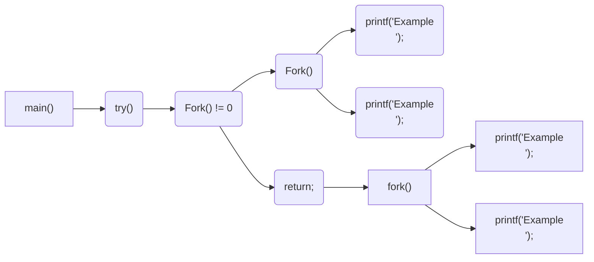
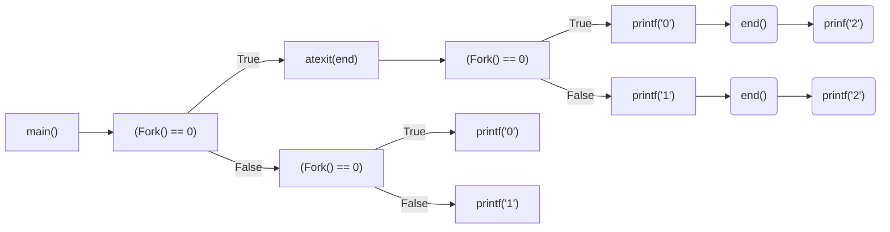

CSED211 Homework 5
===

20190084 권민재


# 1. Exercise 8.14

How many "Example" output lines does this program print?

```c
#include "csapp.h"

void try()
{
    if(Fork() != 0) {
        Fork();
        printf("Example\n");
        exit(0);
    }
    return;
}

int main();
{
    try();
    fork(); printf("Example\n");
    exit(0);
}
```

### Solution



> rectangle for main(), rounded-rectangle for try().

#### try()

 위 프로그램이 실행된 이후에는 우선 `try`가 불리게 되는데, 여기서 `(Fork() != 0)`에서 우선 포크가 일어나게 된다. 이후, `(Fork() != 0)`에 해당하는 프로세스에 대해, `Fork();`가 일어나고, 이후 `printf("Example\n");`에 의해 Example이 try에 의해서는 2번 출력된다.

#### main()

 main 함수에서는 우선 `try`가 종료된 이후에 `fork`를 진행하고, Example을 출력하게 된다. 즉, try()에서 출력되는 Example을 제외했을 때, main에서는 Example이 2번 출력된다.


 위 두 결과를 종합하여, 위 프로그램은 Example을 총 4번 출력한다.

### Answer

 This program print "Example" output lines **4 times**.


# 2. Exercise 8.18

Consider the following program:

```c
#include "csapp.h"

void end(void)
{
	printf("2"); fflush(stdout);
}

int main()
{
    if (Fork() == 0)
        atexit(end);
    if (Fork() == 0){
        printf("0"); fflush(stdout);
    }
    else {
        printf("1"); fflush(stdout);
    }
    exit(0);
}
```

 Determine which of the following outputs are possible. *Note:* The `atexit` function takes a pointer to a function and adds it to a list of functions (initially empty) that will be called when the exit function is called.

---



 위와 같이 프로세스의 다이어그램을 그려보았을 때, 한 프로세스에서 나올 수 있는 출력은 0, 1, 02, 12 중에 하나이다. 그렇기 때문에 0, 1, 02, 12를 하나씩 배열해서 나올 수 있는 문자열이 위 프로그램의 possible한 output이라고 생각할 수 있다.


## A.

**Solution.** 112002는 1, 12, 0, 02를 순서대로 배치한 결과이기 때문에, possible한 output이다.

**Answer.** Possible.


## B.

**Solution.** 2는 무조건 0 또는 1이 출력된 이후에만 출력될 수 있으므로, 2가 맨 처음으로 출력될 수는 없다.

**Answer.** Not possible.


## C.

**Solution.** 102120은 1, 02, 12, 0을 순서대로 배치한 결과이기 때문에, possible한 output이다.

**Answer.** Possible.


## D.

**Solution.** 122001에서 001은 0, 1, 02, 12을 배치해서 나올 수 없는 결과이기에, 불가능하다.

**Answer.** Not possible.


## E.

**Solution.** 100212는 1, 0, 02, 12를 순서대로 배치한 결과이기 때문에, possible한 output이다.

**Answer.** Possible.


# Exercise 8.19 on page 828

# Exercise 8.21 on page 828

# Exercise 9.12 on page 913

# Exercise 9.13 on page 914

# Exercise 9.15 on page 915

# Exercise 9.19 on page 916