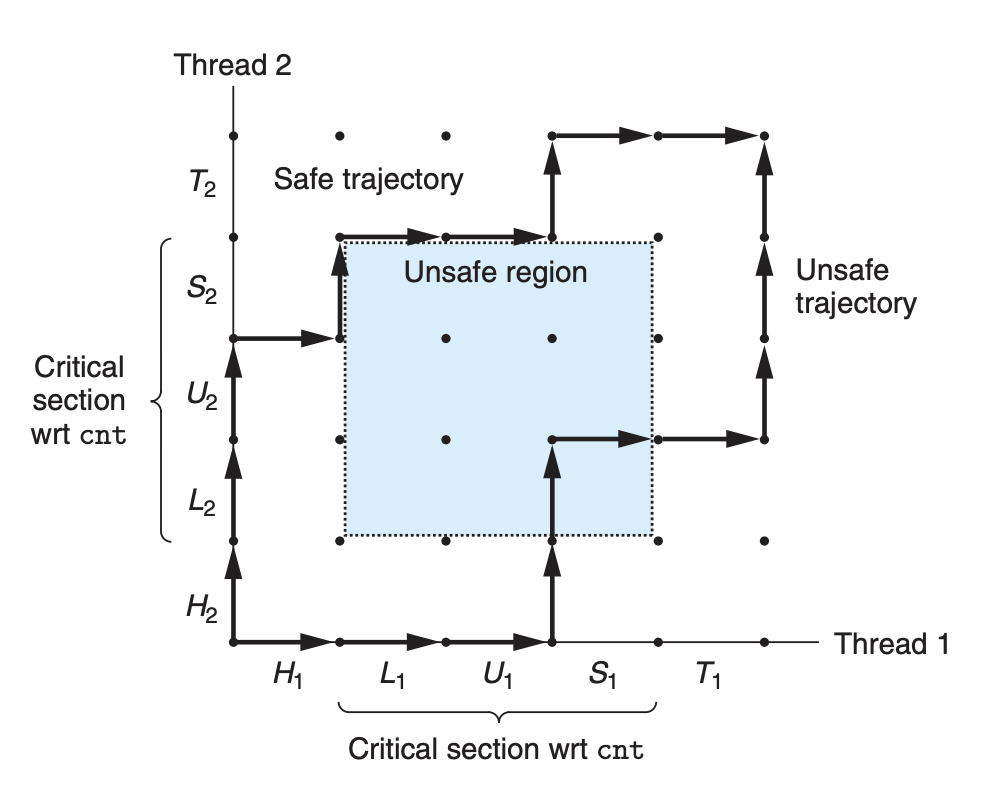

CSED211 Homework 6
===

20190084 권민재


# 1. Exercise 10.6

What is the output of the following program?

```c
#include "csapp.h"

int main()
{
    int fd1, fd2;
    fd1 = Open("foo.txt", O_RDONLY, 0);
    fd2 = Open("bar.txt", O_RDONLY, 0);
    Close(fd2);
  	fd2 = Open("baz.txt", O_RDONLY, 0);
    printf("fd2 = %d\n", fd2);
    exit(0);
}
```


### Solution

File Descriptor (이 문서에서 이하 'FD') 0, 1, 2는 이미 할당된 상태이기 때문에, foo.txt와 bar.txt를 Open 했을 때, `fd1`, `fd2` 에는 우선 각각 FD 3, 4가 지정된다. 이후, `close(fd2)` 를 수행하고 baz.txt를 여는 시점에서 FD 4는 이미 정리되었기 때문에, baz.txt를 Open 한 FD는 4가 지정된다. 즉, fd2를 출력할 때 fd2는 4이다.

### Answer

```
fd2 = 4
```


# 2. Exercise 10.9

Consider the following invocation of the fstatcheck program from Problem 10.8:

```sh
linux> fstatcheck 3 < foo.txt
```

You might expect that this invocation of `fstatcheck` would fetch and display metadata for file `foo.txt`. However, when we run it on our system, it fails with a "bad file descriptor." Given this behavior, fill in the pseudocode that the shell must be executing between the `fork` and `execve` calls:

```c
if(Fork() == 0) { /* child */
    /* What code is the shell executing right here? */
    Execve("fstatcheck", argv, envp);
}
```


### Solution

위와 같은 동작을 수행하기 위해서는, 우선 코드 내에서 foo.txt를 열고, 해당 FD를 `dup2` 를 이용하여 STDIN으로 redirect 시킨 이후에 execve를 수행하여 fstatcheck의 input으로 들어갈 수 있도록 해야한다. 아래는 이 과정을 나타낸 답안이다.

### Answer

```c
/* csapp.h가 include된 상태로 생각하여, csapp.h에 있는 함수 정의를 이용하여 답안을 작성해야한다. (첫글자가 대문자) */
if(Fork() == 0) { /* child */
    /* What code is the shell executing right here? */
    fd = Open("foo.txt", O_RDONLY, 0);
    Dup2(fd, STDIN_FILENO);
    Close(fd);
    Execve("fstatcheck", argv, envp);
}
```

 

# 3. 

Enumerate the difference between process and thread concisely.

### Answer

| Process                                                      | Thread                                                       |
| :----------------------------------------------------------- | :----------------------------------------------------------- |
| 컴퓨터에서 실행 중인 프로그램이다.                           | 프로세스 안의 컨텍스트에서 실행되는 logical flow이다.        |
| 각 프로세스는 필요한 자원을 시스템으로부터 모두 할당받기 때문에, 각 프로세스는 private한 주소 공간을 가진다. | 각 스레드는 스택 영역만을 할당받고, 코드, 데이터, 힙, 공유 라이브러리, 오픈한 파일 등의 영역은 각 스레드가 같은 프로세스의 virtual 주소를 공유한다. |
| 다른 프로세스의 자원에 접근하기 위해서는 IPC 등의 방법을 이용해야 한다. | 다른 스레드의 자원에 접근하기 위해서는 공유하는 영역을 이용하면 된다. |
| 어떤 프로세스가 오류로 강제 종료 되어도, 공유하고 있는 자원을 손상시키지 않는 이상 다른 프로세스에 영향을 미치기 힘들다. | 어떤 스레드가 오류로 강제 종료 되면, 이 스레드를 포함하는  프로세스의 다른 모든 스레드가 종료된다. |


# 4. 

Explain the role of the following functions.

> Function Prototypes are from Linux Man Page.

## A. Getaddrinfo

```c
#include <sys/types.h>
#include <sys/socket.h>
#include <netdb.h>

int getaddrinfo(const char *node, const char *service, const struct addrinfo *hints, struct addrinfo **res);

void freeaddrinfo(struct addrinfo *res);

const char *gai_strerror(int errcode);
```

`getaddrinfo` 함수는 hostnames, host addresses, service names, port numbers를 socket address structure (addrinfo)로 변환하는 역할을 수행한다. 이 함수가 결과값으로서 채워주는 `res` 가 가리키는 addrinfo 구조체는 소켓 연결에 필요한 정보들을 포함하여 함수 `bind`나 `connection` 등을 편리하게 사용할 수 있도록 도와주는 역할을 수행한다. 이 함수는 에러가 나지 않았을 때 0을 반환하고, 아닐 경우에 에러 코드를 반환한다.


## B. Socket

```c
#include <sys/types.h>
#include <sys/socket.h>

int socket(int domain, int type, int protocol);
```

`socket` 함수는 socket descriptor를 만들기 위한 함수로, 에러가 났을 경우에는 -1을 반환하고 아닐 경우에는 양수인 descriptor를 반환하는 역할을 수행한다. 이 반환된 descriptor의 소켓은 기본적으로 완전히 열린 상태는 아니기 때문에, 다른 함수들을 이용해서 소켓을 여는 작업을 마무리해야한다. 인자 `domain`은 communication domain을 나타내며, 통신에 이용할 protocol family을 지정한다. 인자 `type` 은 communication semantic을 지정하고, 인자 `protocol` 은 소켓에 사용될 프로토콜을 지정한다.


## C. Bind

```c
#include <sys/types.h>
#include <sys/socket.h>

int bind(int sockfd, const struct sockaddr *addr, socklen_t addrlen);
```

`bind` 함수는 `sockfd` 가 나타내는 함수 `socket` 을 이용하여 생성된 소켓에 `addr`에 명시되어 있는 주소를 할당하는 역할을 수행한다. 이때, `addrlen` 은 `addr`이 가리키는 Address Structure의 크기를 나타낸다.


## D. Connect

```c
#include <sys/types.h>
#include <sys/socket.h>

int connect(int sockfd, const struct sockaddr *addr, socklen_t addrlen);
```

`connect` 함수는 인자 `addr` 에 적혀있는 주소로 `sockfd` 가 나타내는 소켓을 연결하는, 즉 클라이언트에서 서버와의 연결을 수행하는 역할을 가진다. 이 함수가 실행되는 동안에는 기본적으로 블럭되며, 에러가 났을 경우에는 -1을 반환하고 아닐 경우에는 0을 반환한다. 에러가 발생하지 않았을 경우, 이제 `sockfd`가 나타내는 소켓은 읽고 쓸 준비가 완료되며, 이 소켓에는 서버와 클라이언트 각각의 주소와 포트 정보가 기록된다.


## E. Listen

```c
#include <sys/types.h>
#include <sys/socket.h>

int listen(int sockfd, int backlog);
```

`listen` 함수는 `sockfd` 가 나타내는 소켓을 listening socket (passive socket)으로 지정해서 해당 소켓을 클라이언트로부터 요청을 들을 수 있는 상태로 만드는, 즉 서버와 같은 역할을 수행할 수 있도록 소켓을 지정하는 역할을 수행한다. 인자 `backlog` 는 대기하는 연결이 저장될 큐에 최대한 들어갈 수 있는 커넥션의 개수를 지정한다.


## F. Accept

```c
#include <sys/types.h>
#include <sys/socket.h>

int accept(int sockfd, struct sockaddr *addr, socklen_t *addrlen);
```

`accept` 함수는 서버에서 클라이언트로부터의 요청을 기다리가다 요청이 들어오면 conneted descriptor를 반환하는 역할을 수행한다.  `sockfd` 가 나타내는 listening socket에 대해 클라이언트로부터의 요청을 기다리다가, 요청이 들어오면 이 함수는 인자 `addr`이 가리키는 구조체에 정보를 채우고 connected descriptor를 반환하는데, 이를 이용하여 특정 클라이언트와의 연결을 수립할 수 있다.


# 5. Exercise 12.17

> **Figure 12.46.** Buggy program for Problem 12.17.
>
> ```c
> /* WARNING: This code is buggy! */
> 
> #include "csapp.h"
> void *thread(void *vargp);
> 
> int main()
> {
>     pthread_t tid;
>     Pthread_create(&tid, NULL, thread, NULL);
>     exit(0);
> }
> 
> /* Thread routine */
> void *thread(void *vargp)
> {
>     Sleep(1);
>     printf("Hello, world!\n");
>     return NULL;
> }
> ```

## A.

The program in Figure 12.46 has a bug. The thread is supposed to sleep for 1 second and then print a string. However, when we run it on our system, nothing prints. Why?

### Answer

 `exit` 를 이용해서 프로그램을 종료하게 되면, 프로세스의 모든 스레드가 종료되게 된다. 그런데, 메인 스레드에서 Pthread_create로 스레드를 만들자마자, `exit(0)` 을 이용하여 프로그램을 종료하기 때문에, 다른 스레드에서 `Sleep(1)` 을 마치기도 전에 모든 스레드가 종료되어 아무것도 출력되지 않는다.


## B.

You can fix this bug by replacing the `exit` function in line 10 with one of two different Pthreads function calls. Which ones?

### Answer

`exit` 대신에 `pthread_exit` 를 이용하여 종료를 하게 되면, 프로세스를 종료하기 전에 실행 중인 다른 스레드를 대기하기 때문에 `exit` 를  `pthread_exit` 로 대체해서 위 버그를 고칠 수 있다. 아니면, `pthread_join(tid)` 를 이용해도 된다.


# 6. Exercise 12.18

Using the progress graph in Figure 12.21, classify the following trajectories as either safe or unsafe.

> **Figure 12.21.** Safe and unsafe trajectories.
>
> 

## A. 

$H_2, L_2, U_2, H_1, L_1,S_2,U_1,S_1,T_1,T_2$

**Solution.** $H_1$에서 $L_1$으로 가는 과정에서 Unsafe region에 들어가기 때문에, safe하지 않다.

**Answer.** Unsafe


## B.

$H_2, H_1, L_1, U_1, S_1, L_2, T_1, U_2, S_2, T_2$

**Solution.** 전 구간에서 Unsafe region에 들어가지 않기 때문에, 이 trajectory는 safe하다. 

**Answer.** Safe


## C.

$H_1, L_1, H_2, L_2, U_2, S_2, U_1, S_1, T_1, T_2$

**Solution.** $H_2$ 에서 $L_2$ 로 가는 과정에서 Unsafe region에 들어가기 때문에, safe하지 않다.

**Answer.** Unsafe

